<div align="center">

# 🎓 AnyChange

**A Student Profile Evaluation & Result Tracking App**

<p align="center">
  AnyChange is a comprehensive academic tracking application designed to help students stay on top of their educational journey. Built with Flutter, AnyChange goes beyond simple result viewing to provide intelligent insights, peer comparison tools, precise filtering options, and reliable background monitoring so you never miss a course update.
</p>

</div>

---

## ✨ Key Features

*   **📊 Comprehensive Dashboard**: View a clean, organized, and overview of your academic statistics and recent grades.
*   **🔔 Real-Time & Background Notifications**: Get notified automatically when there is a change in your results, credits, or when a new app version drops—even when the app operates completely in the background.
*   **🔍 Detailed Insights**: Keep track of your maximum and minimum score courses, credit changes, and dive deep into performance analysis on a dedicated insights page.
*   **📅 Year-Wise Filtering**: Filter your grades seamlessly by specific semesters and academic years to visually track your academic progress over time.
*   **🤝 Peer Comparison**: Compare your overall academic standing and marks directly with your peers in an intuitive split-view.

---

## 📱 App Gallery

Experience AnyChange's beautiful, responsive, and carefully crafted user interface.

<table>
  <tr>
    <td align="center"><b>Login Interface</b></td>
    <td align="center"><b>Dashboard Overview</b></td>
    <td align="center"><b>Detailed Dashboard</b></td>
  </tr>
  <tr>
    <td>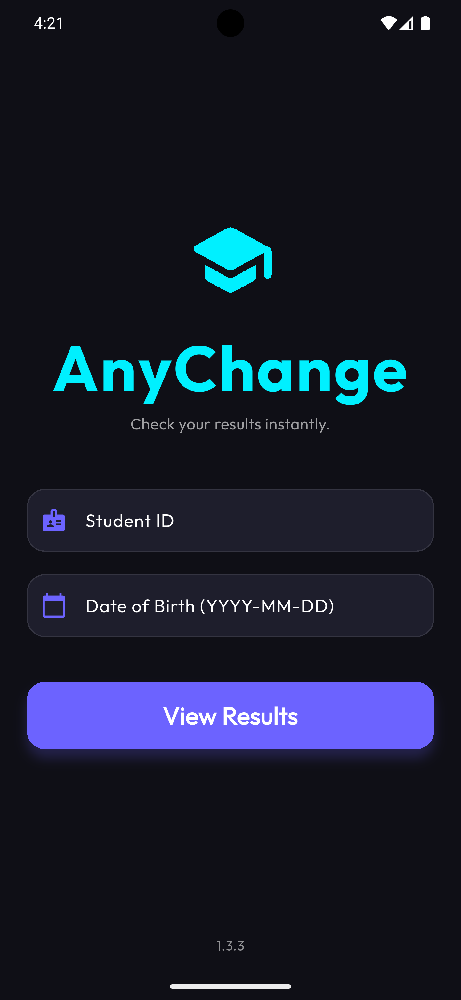</td>
    <td>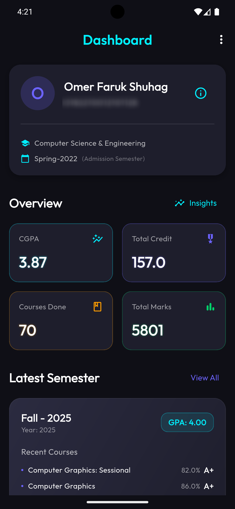</td>
    <td>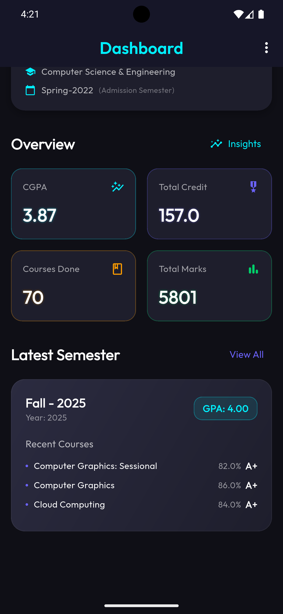</td>
  </tr>
  <tr>
    <td align="center"><b>Academic Insights</b></td>
    <td align="center"><b>All Results View</b></td>
    <td align="center"><b>Menu Options</b></td>
  </tr>
  <tr>
    <td>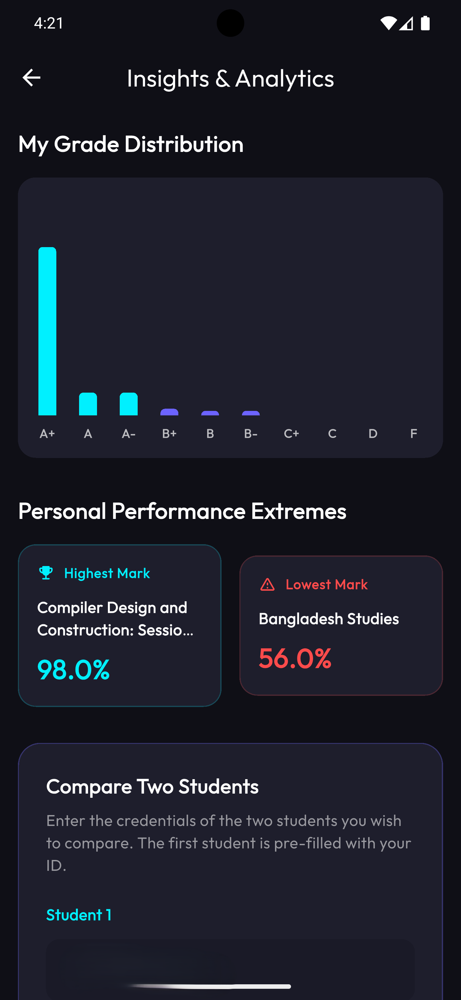</td>
    <td>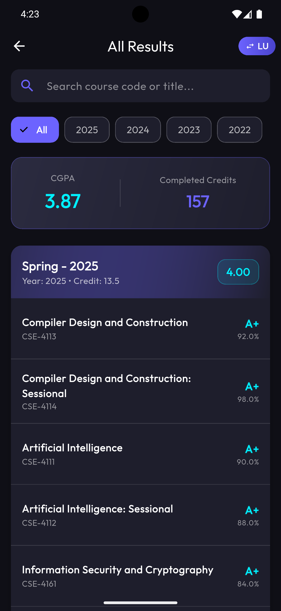</td>
    <td>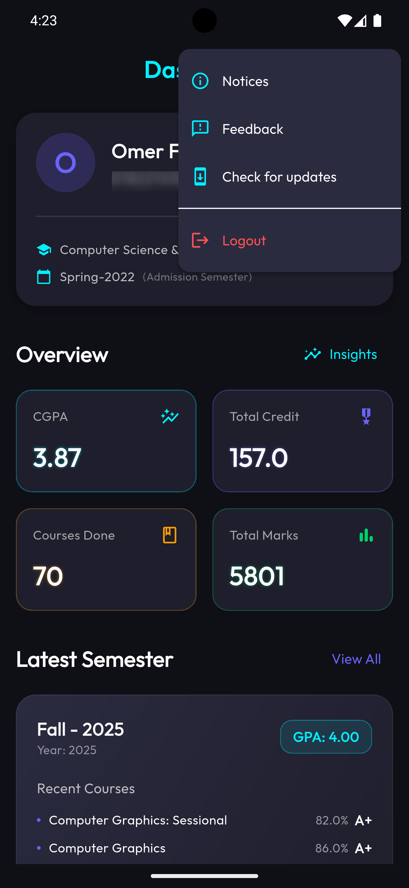</td>
  </tr>
  <tr>
    <td align="center"><b>Compare Profiles</b></td>
    <td align="center"><b>Compare Details 1</b></td>
    <td align="center"><b>Compare Details 2</b></td>
  </tr>
  <tr>
    <td>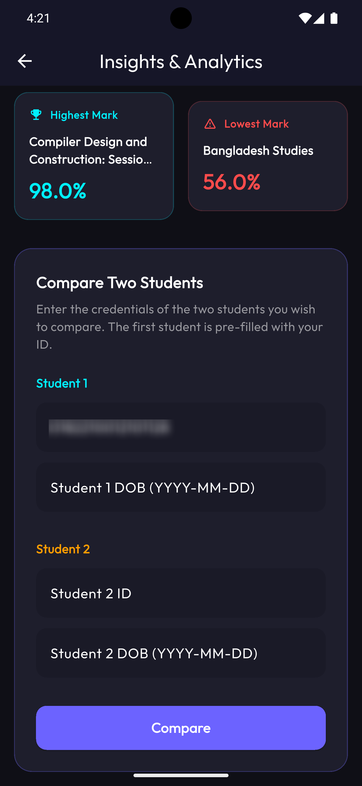</td>
    <td>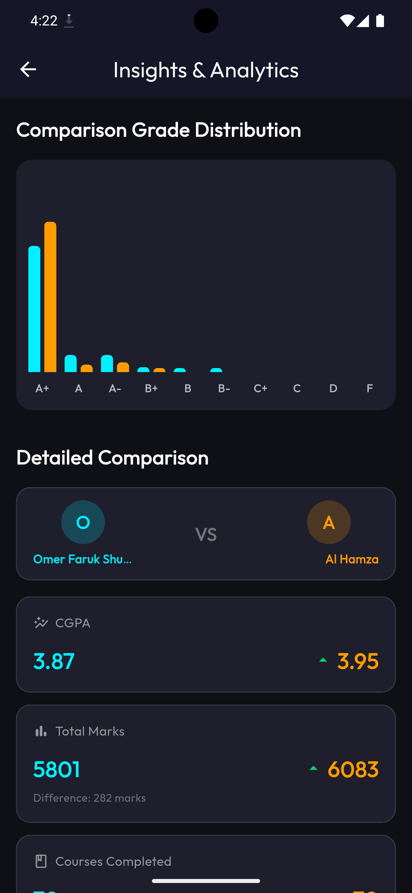</td>
    <td>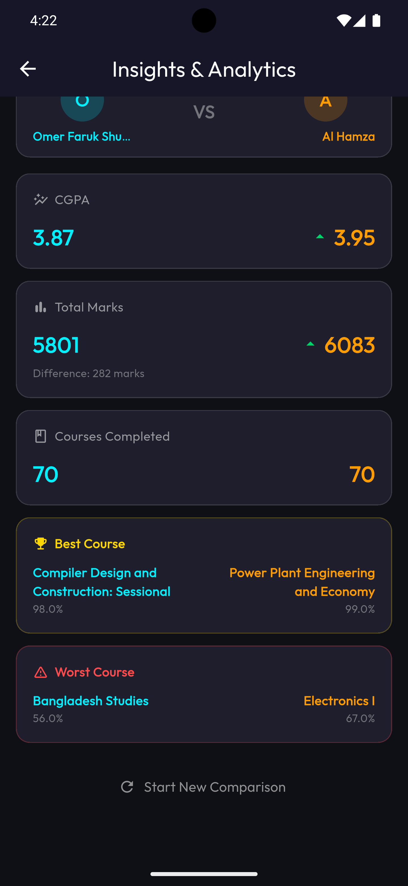</td>
  </tr>
  <tr>
    <td align="center"><b>Year-Wise Filtering</b></td>
    <td align="center"><b>NSU Mode</b></td>
    <td></td>
  </tr>
  <tr>
    <td>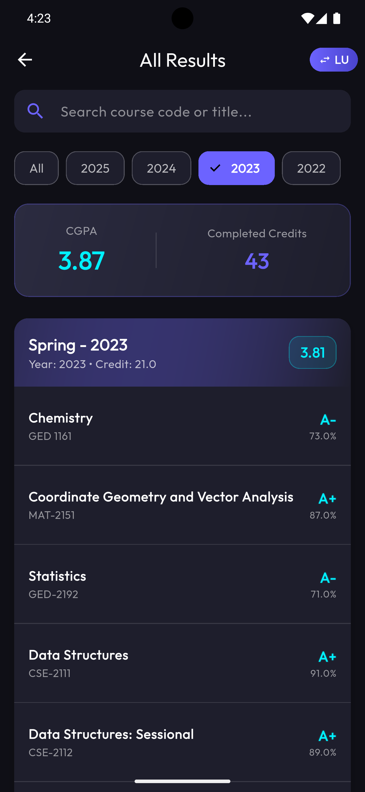</td>
    <td>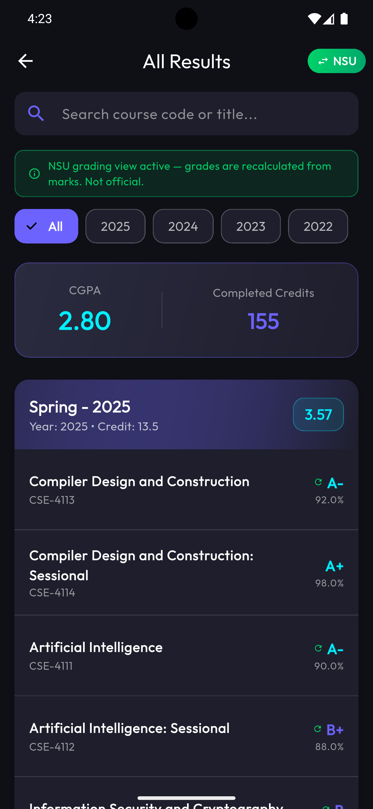</td>
    <td></td>
  </tr>
</table>

---

## 📂 Project Structure

AnyChange adheres to the principles of **Clean Architecture** combined with Domain-Driven Design for maximum scalability and maintainability.

```text
lib/
├── core/                   # Core utilities, constants, theme, and shared services
│   ├── providers/          # Global application providers
│   │   └── core_providers.dart
│   ├── router/             # App routing and navigation config
│   │   └── app_router.dart
│   └── services/           # Background tasks, notifications, and version checking
│       ├── background_service.dart
│       ├── native_background_scheduler.dart
│       ├── notification_service.dart
│       └── version_check_service.dart
├── data/                   # Data layer: API consumption and repositories
│   └── repositories/       # Implementation of repository interfaces
│       └── result_repository.dart
├── domain/                 # Domain layer: Business logic and abstractions
│   ├── models/             # Data models and entities
│   │   └── lus_response.dart
│   ├── repositories/       # Abstract repository interfaces
│   │   └── i_result_repository.dart
│   └── use_cases/          # Independent business logic units
│       ├── auth_use_case.dart
│       └── fetch_result_use_case.dart
├── presentation/           # UI layer: Screens, widgets, and state management
│   ├── providers/          # Riverpod state providers for the UI
│   │   ├── auth_provider.dart
│   │   └── result_provider.dart
│   └── screens/            # Individual application screens
│       ├── home_screen.dart
│       ├── insights_screen.dart
│       ├── login_screen.dart
│       └── result_details_screen.dart
└── main.dart               # System entry point and app initialization
```

---

## 🛠️ Technology Stack

*   **Framework:** Flutter (Mobile + Web)
*   **State Management:** Riverpod (`flutter_riverpod`, `riverpod_annotation`)
*   **Routing:** GoRouter
*   **Network & API:** HTTP
*   **Local Storage:** Shared Preferences
*   **Background Processing:** Native Android
*   **Notifications:** Flutter Local Notifications
*   **Visualizations:** FL Chart
*   **Data Models:** Freezed & JSON Serializable

---
<div align="center">
  <i>Crafted with passion for a better student tracking experience.</i>
</div>
